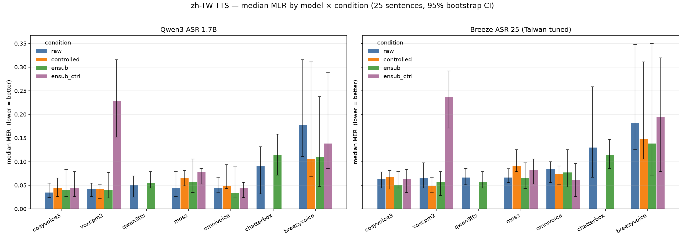
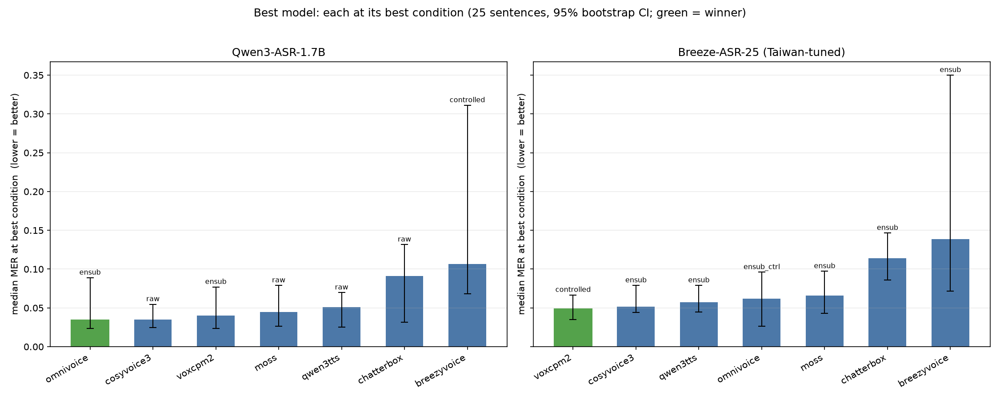
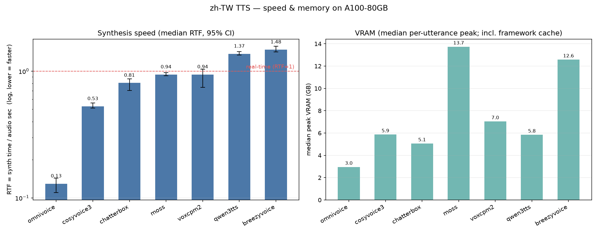
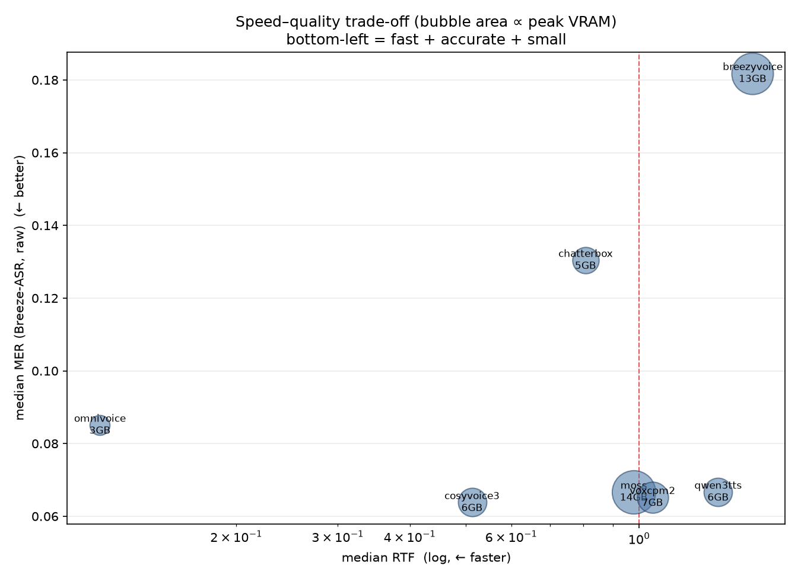

# zh-TW TTS comparison — results

Dataset: JacobLinCool/tw-codeswitch-ner (quick test, 25 sentences). Shared Taiwan reference voice. TTS GPU: **A100-80GB** (uniform → comparable timing/VRAM). Two ASRs, no context: **qwen3** = Qwen3-ASR-1.7B, **breeze** = MediaTek Breeze-ASR-25 (Taiwan-tuned, Whisper-v2). Metric: **median** MER = CER(zh)+WER(en), NFKC+OpenCC normalized. Lower is better. Median, not mean, because Breeze (Whisper) occasionally hallucinates trailing text and spikes a few clips.

> Top 5 models are statistically tied on MER (paired-bootstrap CIs include 0); only chatterbox & breezyvoice are significantly worse. The #1 flips by ASR — MER alone cannot crown a single winner at n=25; use the blind listening test + the speed/VRAM tiebreakers.

## Per-model × condition (median MER)

| Model | Cond | n | MER qwen3 | MER breeze | synth (s) | RTF | VRAM (GB) | err |
|---|---|--:|--:|--:|--:|--:|--:|--:|
| `breezyvoice` | raw | 25 | 0.178 | 0.182 | 19.3 | 1.59 | 48.4 | 0 |
| `breezyvoice` | controlled | 25 | 0.106 | 0.149 | 22.2 | 1.79 | 48.4 | 0 |
| `breezyvoice` | ensub | 25 | 0.111 | 0.139 | 16.0 | 1.40 | 39.4 | 0 |
| `breezyvoice` | ensub_ctrl | 25 | 0.139 | 0.194 | 14.4 | 1.22 | 39.7 | 0 |
| `omnivoice` | raw | 25 | 0.045 | 0.085 | 1.5 | 0.15 | 3.4 | 0 |
| `omnivoice` | controlled | 25 | 0.049 | 0.074 | 1.5 | 0.16 | 3.6 | 0 |
| `omnivoice` | ensub | 25 | 0.034 | 0.078 | 1.0 | 0.10 | 3.5 | 0 |
| `omnivoice` | ensub_ctrl | 25 | 0.044 | 0.062 | 1.2 | 0.12 | 3.6 | 0 |
| `cosyvoice3` | raw | 25 | 0.035 | 0.064 | 6.1 | 0.49 | 6.1 | 0 |
| `cosyvoice3` | controlled | 25 | 0.045 | 0.068 | 6.2 | 0.49 | 6.1 | 0 |
| `cosyvoice3` | ensub | 25 | 0.040 | 0.052 | 10.7 | 0.85 | 6.1 | 0 |
| `cosyvoice3` | ensub_ctrl | 25 | 0.044 | 0.064 | 7.1 | 0.56 | 6.1 | 0 |
| `voxcpm2` | raw | 25 | 0.043 | 0.065 | 14.1 | 1.11 | 8.6 | 0 |
| `voxcpm2` | controlled | 25 | 0.043 | 0.049 | 14.2 | 1.13 | 8.6 | 0 |
| `voxcpm2` | ensub | 25 | 0.040 | 0.057 | 7.8 | 0.61 | 8.6 | 0 |
| `voxcpm2` | ensub_ctrl | 25 | 0.029 | 0.049 | 9.0 | 0.72 | 8.6 | 0 |
| `moss` | raw | 25 | 0.044 | 0.067 | 13.3 | 0.99 | 13.8 | 0 |
| `moss` | controlled | 25 | 0.065 | 0.091 | 14.4 | 1.08 | 13.8 | 0 |
| `moss` | ensub | 25 | 0.057 | 0.066 | 12.2 | 0.97 | 13.8 | 0 |
| `moss` | ensub_ctrl | 25 | 0.079 | 0.083 | 11.1 | 0.87 | 13.9 | 0 |
| `qwen3tts` | raw | 25 | 0.051 | 0.067 | 19.0 | 1.46 | 6.4 | 0 |
| `qwen3tts` | ensub | 25 | 0.055 | 0.057 | 17.1 | 1.36 | 6.5 | 0 |
| `chatterbox` | raw | 25 | 0.091 | 0.130 | 11.9 | 1.03 | 7.8 | 0 |
| `chatterbox` | ensub | 25 | 0.114 | 0.114 | 10.4 | 0.81 | 8.7 | 0 |

## Length robustness (raw, median MER: short XS/S vs long M)

| Model | short | long | Δ (long−short) |
|---|--:|--:|--:|
| `breezyvoice` | 0.139 | 0.411 | +0.272 |
| `omnivoice` | 0.044 | 0.049 | +0.004 |
| `cosyvoice3` | 0.035 | 0.035 | -0.000 |
| `voxcpm2` | 0.044 | 0.037 | -0.007 |
| `moss` | 0.060 | 0.032 | -0.028 |
| `qwen3tts` | 0.040 | 0.061 | +0.021 |
| `chatterbox` | 0.077 | 0.174 | +0.097 |

> Positive Δ = degrades on long utterances. BreezyVoice breaks down on long inputs (repetition/degeneration); CosyVoice3 / VoxCPM2 / MOSS / OmniVoice stay robust.

## ASR cross-check (raw, median) — does the Taiwan-tuned ASR rate models differently?

| Model | MER qwen3 | MER breeze | breeze − qwen3 |
|---|--:|--:|--:|
| `breezyvoice` | 0.178 | 0.182 | +0.004 |
| `omnivoice` | 0.045 | 0.085 | +0.040 |
| `cosyvoice3` | 0.035 | 0.064 | +0.029 |
| `voxcpm2` | 0.043 | 0.065 | +0.023 |
| `moss` | 0.044 | 0.067 | +0.022 |
| `qwen3tts` | 0.051 | 0.067 | +0.015 |
| `chatterbox` | 0.091 | 0.130 | +0.040 |

> Both ASRs broadly agree on the median. Large gaps flag ASR disagreement, not necessarily TTS quality.

## Phonetic-control lift (raw → controlled Δ median MER; negative = control helped)

| Model | Δ qwen3 | Δ breeze |
|---|--:|--:|
| `breezyvoice` | -0.071 | -0.033 |
| `omnivoice` | +0.003 | -0.011 |
| `cosyvoice3` | +0.011 | +0.004 |
| `voxcpm2` | +0.000 | -0.016 |
| `moss` | +0.021 | +0.024 |

> `chatterbox` and `qwen3tts` expose no phonetic-control path (raw only).

## English-name substitution (raw → ensub, Δ median MER)

Sentences re-rendered with real English brand names (Coach, Adidas, Hermès, …) instead of Chinese transliterations (蔻馳, 愛迪達, 愛馬仕). Negative Δ = the model handles the English names better.

| Model | Δ qwen3 | Δ breeze |
|---|--:|--:|
| `breezyvoice` | -0.067 | -0.043 |
| `omnivoice` | -0.011 | -0.008 |
| `cosyvoice3` | +0.005 | -0.012 |
| `voxcpm2` | -0.003 | -0.008 |
| `moss` | +0.013 | -0.001 |
| `qwen3tts` | +0.004 | -0.010 |
| `chatterbox` | +0.023 | -0.016 |

## Intelligibility ranking — qwen3 (best condition, median MER)

1. **cosyvoice3** — MER 0.035 (raw)
2. **voxcpm2** — MER 0.043 (controlled)
3. **moss** — MER 0.044 (raw)
4. **omnivoice** — MER 0.045 (raw)
5. **qwen3tts** — MER 0.051 (raw)
6. **chatterbox** — MER 0.091 (raw)
7. **breezyvoice** — MER 0.106 (controlled)

## Intelligibility ranking — breeze (best condition, median MER)

1. **voxcpm2** — MER 0.049 (controlled)
2. **cosyvoice3** — MER 0.064 (raw)
3. **moss** — MER 0.067 (raw)
4. **qwen3tts** — MER 0.067 (raw)
5. **omnivoice** — MER 0.074 (controlled)
6. **chatterbox** — MER 0.130 (raw)
7. **breezyvoice** — MER 0.149 (controlled)

## Speed & memory (A100-80GB)

> RTF = container-side synth time / audio seconds (log axis; <1 = faster than real time). VRAM = median per-utterance peak device occupancy incl. framework cache (the MAX is an allocator high-water spike, e.g. breezyvoice ranges ~7–48 GB, so median ~13 GB is reported).

---
Audio: `outputs/<model>/<condition>/<id>.wav` (human listening). Per-sentence records incl. both ASR hypotheses: `outputs/results.jsonl`.